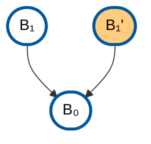
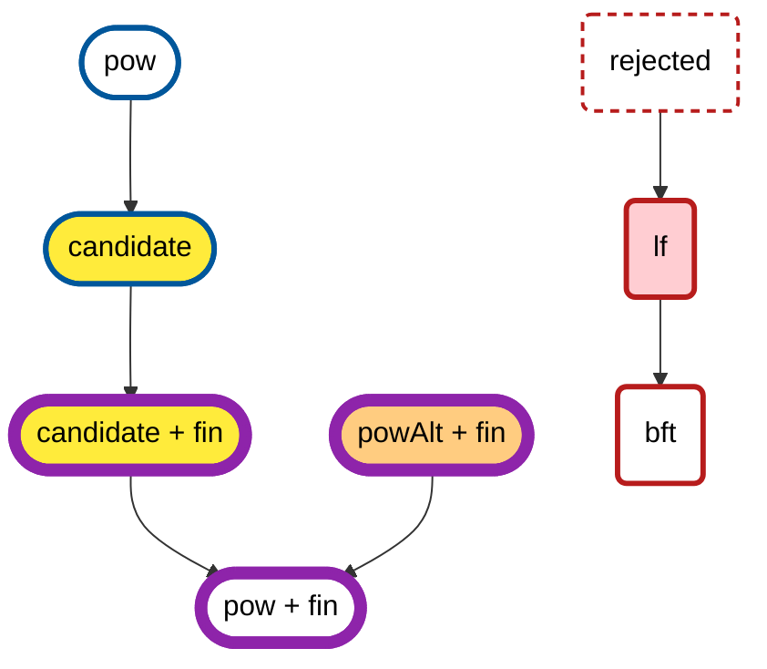

# Mermaid Common Styles

This file contains reusable Mermaid style definitions for diagrams throughout the book.

## How to Use

Copy the relevant style definitions from this page into your Mermaid diagrams. While the styles are also defined in `mermaid-common-styles.js` for potential programmatic use, Mermaid requires `classDef` statements to be included within each diagram block.

## PoW Block Styles

For Proof-of-Work blockchain diagrams:

```text
%% Define PoW block style with dark blue border and oval shape
classDef pow fill:#fff,stroke:#01579b,stroke-width:3px,color:#000
%% Define alternative PoW block style with orange fill for caution
classDef powAlt fill:#ffcc80,stroke:#01579b,stroke-width:3px,color:#000
```

### Usage Example



## Crosslink Finality Styles

For diagrams that show both chains and the finality markers, as in [A Visual Guide to Finality and Fork Choice](../guides/finality-and-fork-choice.md). Use `pow` for PoW blocks on the node's best chain and `powAlt` for PoW blocks off it.

```text
%% Define PoS / BFT block style with dark red border
classDef bft fill:#fff,stroke:#b71c1c,stroke-width:3px,color:#000
%% Define style for the BFT block that a PoW block's context_bft makes final, LF(H)
classDef lf fill:#ffcdd2,stroke:#b71c1c,stroke-width:3px,color:#000
%% Define style for a BFT proposal that the validity rules reject
classDef rejected fill:#fff,stroke:#b71c1c,stroke-width:2px,stroke-dasharray:5 4,color:#000
%% Define style for the PoW block that is candidate(H), with yellow fill
classDef candidate fill:#ffeb3b,stroke:#01579b,stroke-width:3px,color:#000
%% Define fin last, so that its border wins over the block style.
classDef fin stroke:#8e24aa,stroke-width:7px
```

`fin` only sets a border, so add it on top of a block's own style with a `class` statement, such as `class P5 fin`. Both styles then set a border, and Mermaid lets the one defined later win, so `classDef fin` must come after the others.

### Usage Example



## Node Type Styles

Standard node types used across diagrams:

```text
classDef input fill:#e1f5ff,stroke:#01579b,stroke-width:3px,color:#000
classDef compute fill:#fff3e0,stroke:#e65100,stroke-width:2px,color:#000
classDef aggregate fill:#f3e5f5,stroke:#4a148c,stroke-width:2px,color:#000
classDef output fill:#e8f5e9,stroke:#1b5e20,stroke-width:3px,color:#000
classDef storage fill:#fce4ec,stroke:#880e4f,stroke-width:2px,color:#000
```
