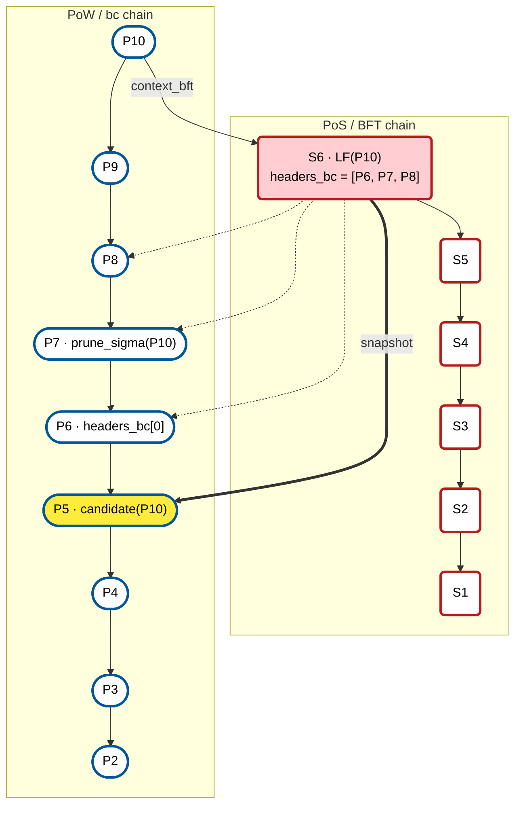
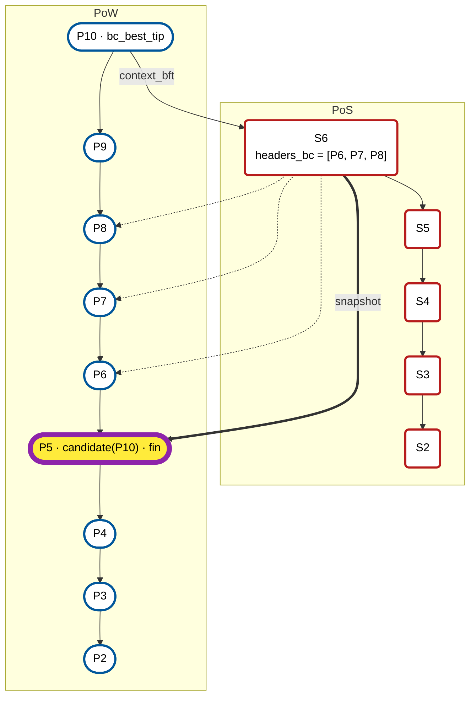
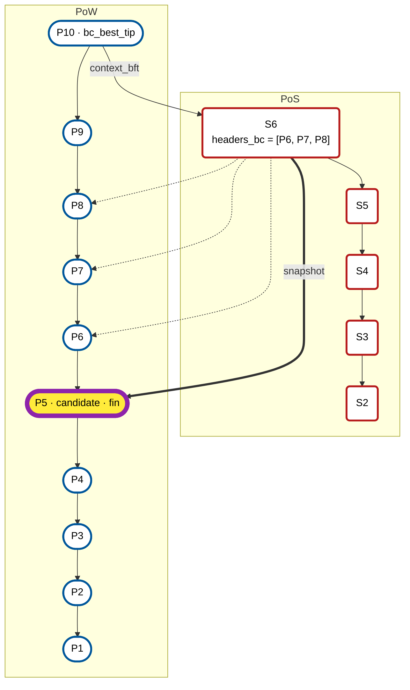
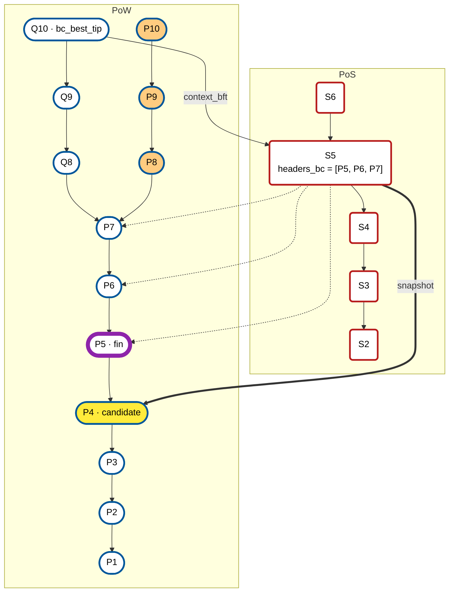
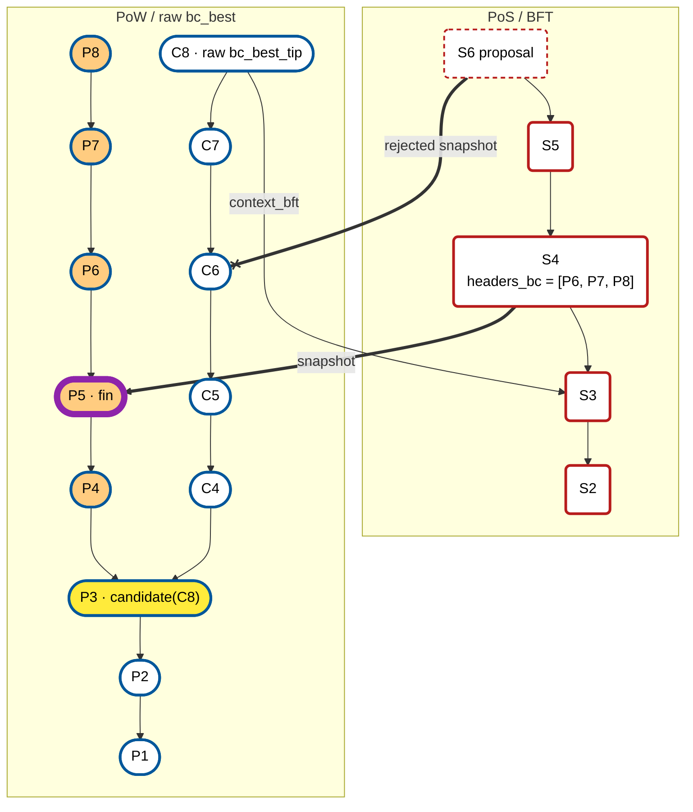
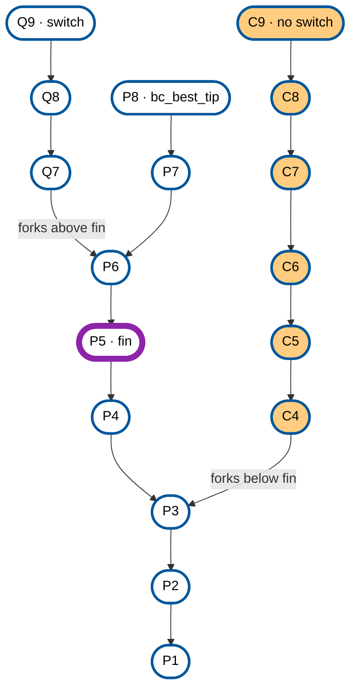

# A Visual Guide to Finality and Fork Choice

A Zebra Crosslink node tracks three points on the PoW chain. This guide shows how each one is found, and what happens to them when the PoW chain reorganizes.

- **`bc_best`** is the PoW chain that the node's fork choice selects, and `bc_best_tip` is its newest block. It is available but not final.
- **`candidate(H)`** is the finalization point that a PoW block `H` and its linked ancestry imply. It is objective: every correct replay of the same `H` gets the same answer.
- **`fin`** is the furthest compatible `candidate(bc_best_tip)` that this node has accepted across best-chain updates. It is node-local memory and never moves backward.

A candidate can move backward without the best chain crossing `fin`; that is the [benign case](#benign-case-the-candidate-moves-backward). A best chain that actually forks below `fin` is a different, [exceptional case](#exceptional-case-the-best-chain-forks-below-fin).

## Reading the diagrams

Newer blocks are at the top. Arrows are committed references, not message flow: each one points from a block to something that block names.

| Drawn as | Meaning |
|---|---|
| Rounded block, blue border, white fill | PoW block on the node's best chain |
| Rounded block, orange fill | PoW block off the node's best chain |
| Box, red border | PoS / BFT block |
| Box, pink fill | `LF(H)`: the last final BFT block in the context of `H` |
| Box, dashed red border | BFT proposal that the validity rules reject |
| Yellow fill | `candidate(H)` for the best tip `H` |
| Thick purple border | `fin` |
| Plain arrow | Parent link |
| Arrow labelled `context_bft` | The BFT block that a PoW block cites |
| Dotted arrow | A PoW header carried in a BFT block's `headers_bc` |
| Thick arrow labelled `snapshot` | `snapshot(B)`: the parent of the deepest header in `B.headers_bc` |

`a ⪯ b` means that `a` is `b` or an ancestor of `b`. Two blocks *conflict* when neither is an ancestor of the other.

The styles are listed in [Mermaid Common Styles](../editing/mermaid-styles.md).

## How `candidate(H)` crosses both chains



Starting from `H = P10`:

1. `P10.context_bft` cites `S6`. Tenderlink decides each BFT block on its own, and the fat pointer in `context_bft` carries the signatures of that decision, so the cited block is final and `LF(P10) = S6`. The Book's generic BFT protocol can instead finalize an ancestor of the cited block.
2. `S6.headers_bc = [P6, P7, P8]`, deepest first. Its snapshot is the parent of `headers_bc[0]`: `snapshot(S6) = parent(P6) = P5`.
3. `prune_sigma(P10)` drops the newest `sigma` blocks: `P7` when `sigma = 3`.
4. The candidate is the last common ancestor of those two blocks:

```text
candidate(P10) = lca(snapshot(LF(P10)), prune_sigma(P10)) = lca(P5, P7) = P5
```

The [lexicon](./tfl-lexicon.md) quotes the Book's definitions of `snapshot`, `LF` and `candidate`.

## All three values name PoW-chain points

The PoS chain helps compute the candidate, but `bc_best_tip`, `candidate` and `fin` are all tips of PoW-chain prefixes.



- **`bc_best_tip = P10`** is the fork-choice result, not finality. `P6`–`P10` are unfinalized, and no protocol rule bounds this gap: Zebra Crosslink omits Stalled Mode, so nothing limits how far the best chain runs ahead of `fin`.
- **`candidate(P10) = P5`** is the objective result of the two-chain walk. It is pure, and it can move backward while the best chain still contains `fin`.
- **`fin` advances from `P4` to `P5`**, because on this `bc_best` update the candidate is ahead of it. It is stateful and never rolls back locally.

## Benign case: the candidate moves backward

A shallow PoW reorg can expose an older BFT context. Its derived candidate can therefore be an ancestor of `fin`. That is not a rollback through finality: the complete new best chain still descends from `fin`.

### Before: `fin` advances

`bc_best_tip = P10` cites `S6`, whose snapshot `P5` is the candidate, so `fin` advances to `P5`.



```text
bc_best = P10 · candidate = P5 · fin = P5
```

### After: the candidate is older, not conflicting

The higher-work Q branch replaces only `P8`–`P10`, so `bc_best_tip = Q10` still contains `fin = P5`. Its older BFT context yields candidate `P4`. Hold `fin` at `P5`.



```text
bc_best = Q10 · candidate = P4 · fin = P5 · fin ⪯ Q10
```

**Why this is benign:** `S5` carries `[P5, P6, P7]`, so `snapshot(S5) = P4`. Its child `S6` carries `[P6, P7, P8]`, so `snapshot(S6) = P5`. The snapshots are linear, and both the old P chain and the new Q chain contain `fin = P5`. Only the derived candidate moved backward.

### What the node does on each best-chain update

| Situation | Action |
|---|---|
| `candidate(bc_best_tip)` descends from `fin` | Advance `fin` to the candidate. |
| The candidate is an ancestor of `fin` | Hold `fin`. This can be benign, when the complete `bc_best` still contains `fin`. |
| The candidate conflicts with `fin` | Hold `fin` and record a finalization safety hazard. |
| `bc_best_tip` itself conflicts with `fin` | Hold `fin`. The candidate test may only report "ancestor", so detect this separately. |

**Do not conflate two tests.** `fin ⪯ candidate(bc_best_tip)` can fail merely because the candidate lands behind `fin`; that does not mean the best chain has rolled back a finalized block. A full-best-chain conflict means that `fin` and `bc_best_tip` are on different forks. The candidate test alone does not detect it: the candidate of a conflicting tip can still be an ancestor of `fin`, as the next section shows.

## Exceptional case: the best chain forks below `fin`

This is not the benign case above. Because `fin` came from a previously `sigma`-confirmed prefix, a later `bc_best` that conflicts with it means that this execution does not satisfy PoW Prefix Consistency at that confirmation depth.

**Prefix Consistency failure at `sigma`: `fin = P5` conflicts with raw `bc_best = C8`.**



The higher-work C chain forks from `P3`, below finalized `P5`. `C8` cites the older BFT block `S3`, and that context gives `candidate(C8) = P3`. The arrows for `S4`'s three headers are left out to keep the picture readable; they would point at `P6`, `P7` and `P8`.

1. **Prefix Consistency at `sigma` failed.** A previously `sigma`-confirmed prefix was displaced.
2. **CL2 keeps `C8` as `bc_best`.** The highest-score valid chain wins. No CL2 rule requires raw `bc_best` to contain `fin`.
3. **Abstract CL2 rejects the crossing.** Linearity keeps valid snapshots on the P branch, so a proposal `S6` whose snapshot is on the C fork is rejected.
4. **`candidate(C8) = P3`; `fin` stays `P5`.** No C block can advance this finalization point. With no Stalled Mode, C blocks still carry ordinary spends.

**Result:** miners extend an unfinalizable best chain with ordinary spends, and the finality gap grows without bound. Raw fork choice may return to P; intervention is needed only if C stays dominant and finality must resume elsewhere.

**The diagram shows the abstract CL2 path, not current Zebra.** It assumes BFT Final Agreement and objective enforcement of the Linearity and Tail Confirmation validity rules. With those, the BFT snapshot history cannot cross to C, so `fin` remains `P5` while C is dominant. Zebra enforces both rules in BFT validation, so there this outcome rests on BFT Final Agreement alone. But Zebra does not follow raw `bc_best` onto C in the first place:

- **Abstract CL2 response.** Keep raw `bc_best = C8`, keep `fin = P5`, and prevent valid BFT snapshots from crossing forks. With Stalled Mode omitted, nothing restricts later C blocks: spends accumulate past `fin` for as long as C dominates, and would be rolled back if the best chain returns to P.
- **Zebra Crosslink response.** Sticky fork choice, described next. The node commits up to `fin`, which discards every chain that does not contain it, and rejects blocks that fork below its finalized tip. `C8` never becomes its best chain, whatever C's work; the node stays on P and keeps `fin = P5`. This enforces `fin ⪯ bc_best`, not the stronger property that an unfinalized `sigma`-deep prefix can never be displaced. Raw CL2 does not impose this rule; it is a Zebra Crosslink decision.

## Sticky fork choice

Sticky fork choice selects `bc_best` so that the node's own `fin` stays on its best chain. It is temporal: the result depends on the chain the node is already on and on its current `fin`, not only on the chains in view.



The node's current chain ends at `P8`, and `fin = P5`. It switches from its current chain to a new one if and only if:

```text
fin ⪯ new  and  (work(new) > work(current)  or  equal work and greater tip hash)
```

- **`Q9`: more work, contains `fin = P5`.** Switch. Raw work-based fork choice does the same.
- **`C9`: more work, forks at `P3`, below `fin`.** No switch, whatever C's work. Raw fork choice switches and leaves `fin` off `bc_best`.
- **`fin` advances only to `candidate(bc_best)`.** `candidate(bc_best) ⪯ bc_best`, so the node's best chain always contains its `fin`.

## Summary

`bc_best` is raw fork choice, `candidate(H)` is objective evidence, and `fin` is node-local monotone memory. An application either stops with `fin` during a finalization stall, or follows `bc_best` with no bound on how far it runs past `fin`. Sticky fork choice, the rule Zebra Crosslink implements, selects `bc_best` only among chains containing `fin`, ordered by work and then tip hash.
